# Habitly

<p align="center">
  
</p>

<p align="center">
  Habitly — мобильное приложение для формирования полезных привычек, отслеживания прогресса и поддержания мотивации с помощью статистики, достижений и групповых механик.
</p>

## О проекте

Habitly объединяет ежедневный трекинг привычек, наглядную аналитику, умные напоминания и элементы геймификации. Пользователь может планировать привычки, отмечать выполнение, следить за сериями и прогрессом, получать достижения, повышать уровень и участвовать в группах с общей статистикой и рейтингом.

Проект состоит из:

- `frontend/` — мобильное приложение на Flutter.
- `backend/` — API и бизнес-логика на Python (FastAPI).

## Что умеет приложение

- создавать новые привычки.
- редактировать существующие привычки.
- задавать название, описание, периодичность и время выполнения.
- включать напоминания для конкретной привычки и настраивать отдельное время напоминания.
- создавать личные и групповые привычки.
- распределять привычки по группам и фильтровать их на главном экране.
- отмечать выполнение привычек по дням и видеть дневной прогресс.
- отслеживать личную статистику за день, неделю и месяц.
- смотреть серию, максимальную серию, процент выполнения, баллы и пропуски.
- получать достижения за регулярность и прогресс.
- повышать уровень и следить за прогрессом до следующего уровня.
- работать с группами: создавать группы, открывать детали группы и смотреть общий рейтинг.
- видеть общую статистику группы, групповые награды и отправлять реакции лидеру.
- выходить из группы и управлять составом участников.
- использовать центр уведомлений с историей событий.
- получать push-уведомления о привычках, групповых событиях, сериях и сервисных изменениях.
- помечать уведомления как прочитанные.
- управлять уведомлениями: общий переключатель, звук и вибрация.
- менять оформление приложения: переключать светлую, тёмную и системную темы.
- открывать профиль с карточкой пользователя, уровнем и настройками.

## Основные экраны

- Стартовый экран и логотип приложения.
- Экран привычек с прогрессом за день, фильтрацией по группам и быстрым добавлением.
- Экран создания и редактирования привычки с настройкой времени, периодичности и напоминаний.
- Экран статистики с сериями, процентом выполнения, баллами, пропусками и аналитикой по каждой привычке.
- Экран достижений с целями, уже полученными наградами и прогрессом пользователя.
- Экран уровня пользователя с текущими очками и прогрессом до следующего уровня.
- Экран групп с общей статистикой, рейтингом, наградами группы и реакциями.
- Экран профиля с уровнем, уведомлениями, историей уведомлений и оформлением.
- Экран настроек уведомлений с управлением звуком, вибрацией и общим разрешением на уведомления.

## Скриншоты

| Экран входа | Привычки | Статистика |
| --- | --- | --- |
| 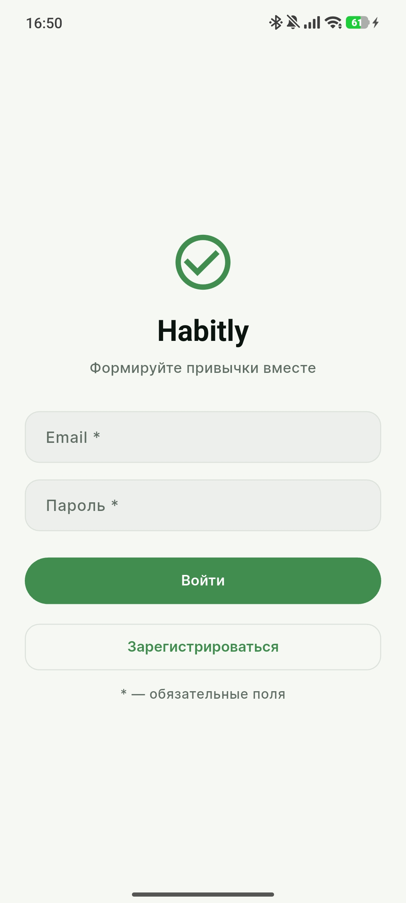 | 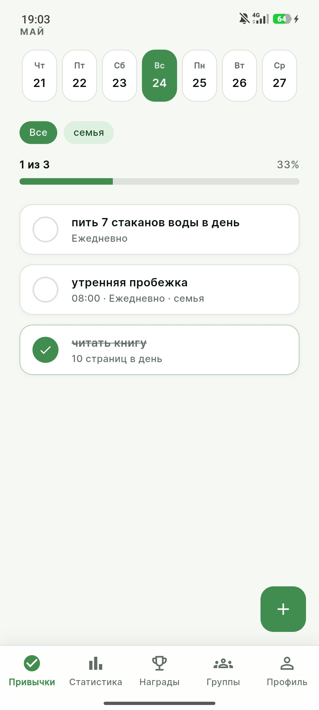 | 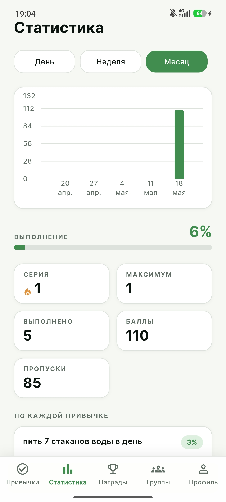 |

| Достижения | Профиль | Группы |
| --- | --- | --- |
| 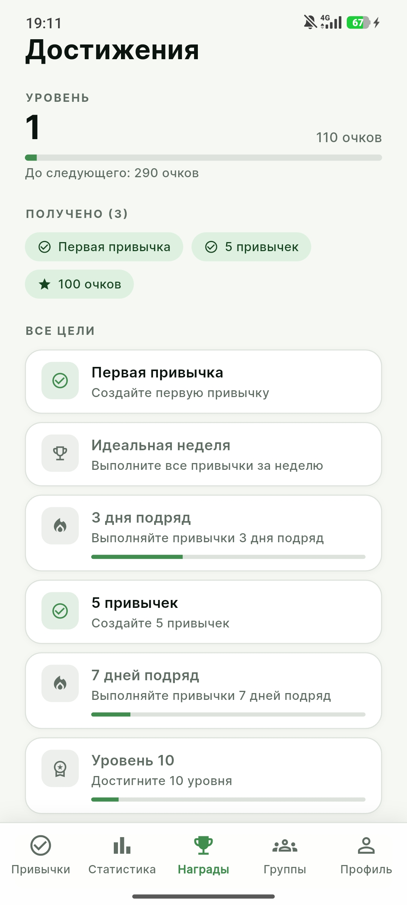 | 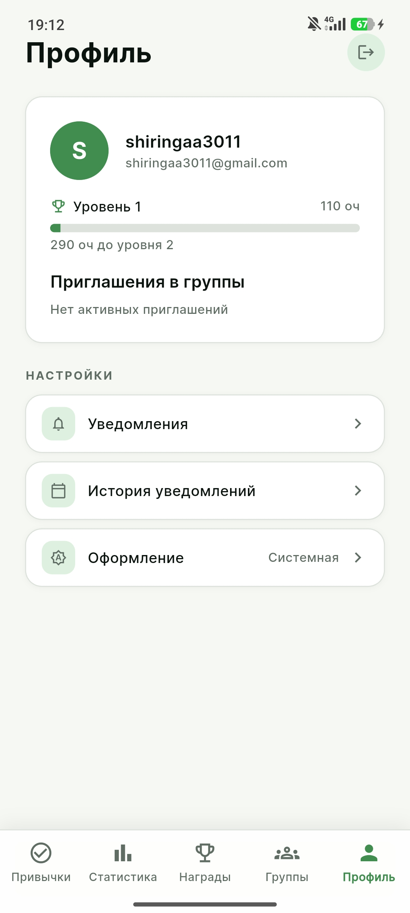 | 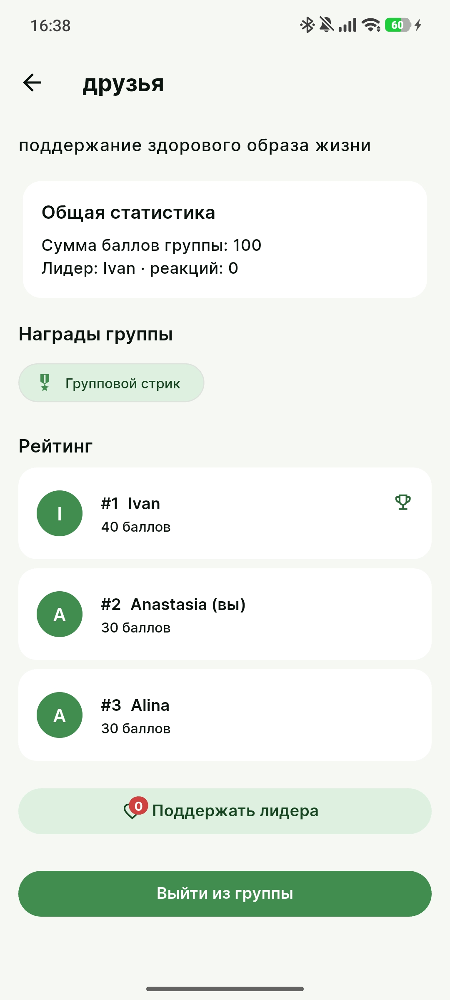 |

### Тёмная тема

| Экран входа | Привычки | Статистика |
| --- | --- | --- |
| 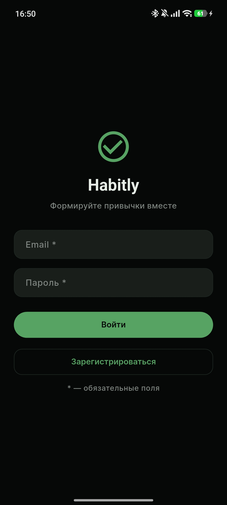 | 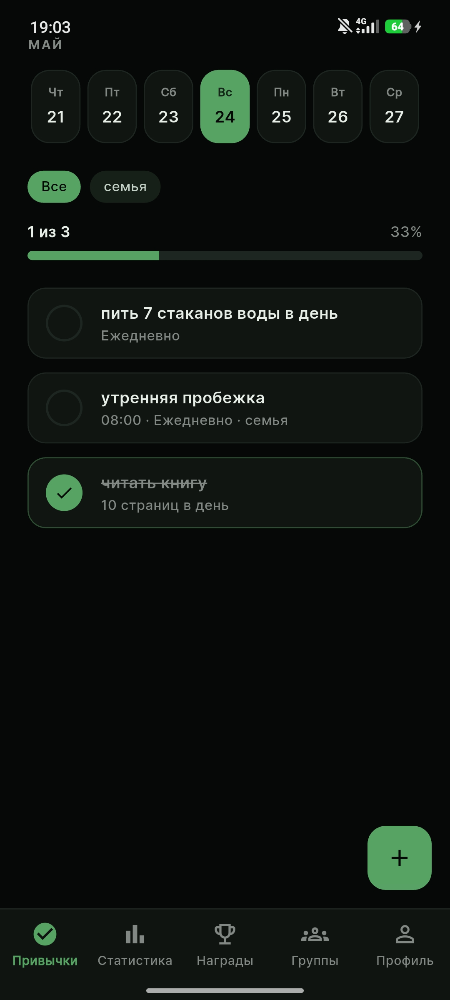 | 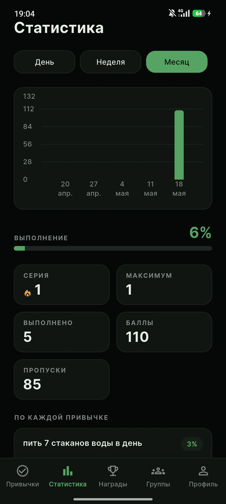 |

| Достижения | Профиль | Группы |
| --- | --- | --- |
| 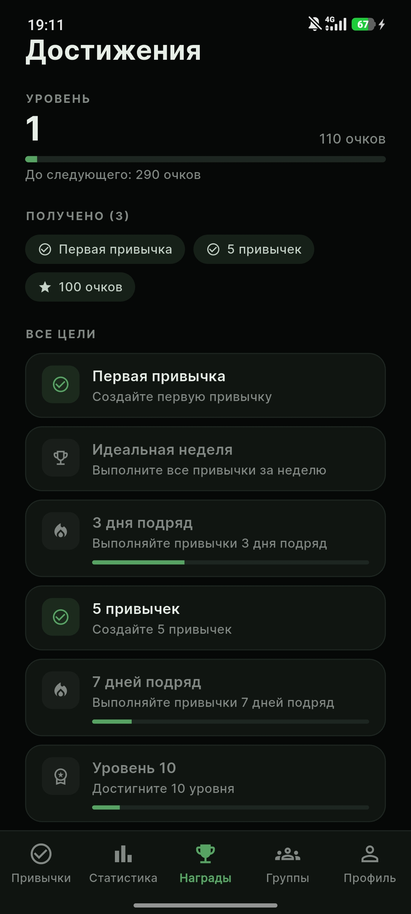 | 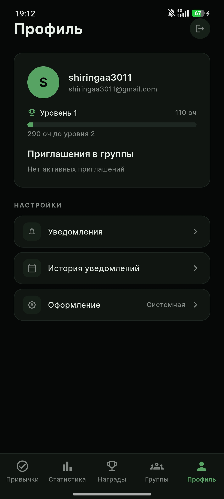 | 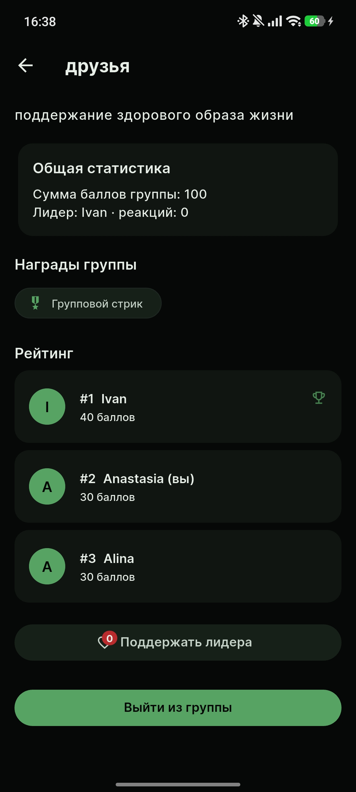 |

## Темы оформления

Приложение поддерживает:

- светлую тему.
- тёмную тему.
- системную тему с автоматическим переключением.

## Технологический стек

### Frontend

- Flutter
- Firebase Cloud Messaging
- `flutter_bloc`
- `get_it`
- `dio`
- `hive`
- `fl_chart`

### Backend

- FastAPI
- SQLAlchemy
- Alembic
- PostgreSQL
- `pytest`
- `pytest-asyncio`

## Архитектура

Клиентская часть организована по feature-based подходу с разделением на `data`, `domain` и `presentation`. Серверная часть разделена на API-слой, доменные сервисы, репозитории, схемы и инфраструктурные модули.

## Структура репозитория

```text
Hability_rep/
├── assets/
│   └── readme/
├── backend/
│   ├── app/
│   │   ├── api/
│   │   ├── core/
│   │   ├── domain/
│   │   ├── infrastructure/
│   │   └── schemas/
│   ├── alembic/
│   └── tests/
├── frontend/
│   ├── lib/
│   │   ├── core/
│   │   └── features/
│   └── test/
└── docker-compose.yml
```

## Основные разделы API

- `/api/v1/gamification`
- `/api/v1/stats`
- `/api/v1/achievements`
- `/api/v1/groups`
- `/api/v1/habits`
- `/api/v1/notifications`

После запуска backend документация доступна по адресам:

- Swagger UI: `http://localhost:8000/api/v1/docs`.
- ReDoc: `http://localhost:8000/api/v1/redoc`.

## Локальный запуск

### Backend через Docker

```bash
cd Hability_rep
docker-compose up --build
docker exec -it habitly_backend alembic upgrade head
```

Будут подняты:

- PostgreSQL на `localhost:5432`.
- FastAPI backend на `localhost:8000`.

### Backend локально

```bash
cd Hability_rep/backend
python -m venv .venv
source .venv/bin/activate
pip install -r requirements.txt
alembic upgrade head
python main.py
```

### Frontend

```bash
cd Hability_rep/frontend
flutter pub get
flutter run
```
